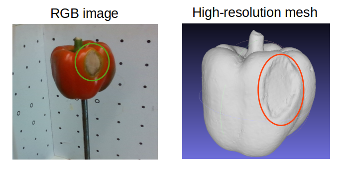
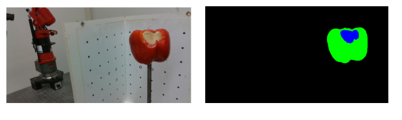

# Sweet pepper mesh reconstruction leveraging RGB textures

This work is an extension of original work done by [Federico](https://www.ipb.uni-bonn.de/wp-content/papercite-data/pdf/magistri2024icra.pdf) et al. at the University of Bonn. The original code is available in the [repository ](https://github.com/PRBonn/TCoRe/tree/master).

Sweet peppers with defects are distinctly identified by the color variations in the pepper. We investigate if we can leverage this color information (RGB)) in addition to the RGB information to get precise shape of peppers.



Full credits to the authors of the paper for the base code. We only use the perform RGB projection on top of the base code. 

#### Requirements

The requirements are same as the one used in the original[ repository ](https://github.com/PRBonn/TCoRe/tree/master), follow that to install all the dependencies. 

#### Key steps

- In addition to the point cloud, we extract RGB image features and interpolate to per pixel features. We used a pretrained UNet feature extractor that is trained to segment the defect regions in the pepper as shown in the image below.



- The extracted features are then raycasted to the vertices of the template mesh and combined with the point cloud features for training.
- We evaluate the reconstructed mesh using precision, recall and F1-score metrics provided by [tanks and temples](https://www.tanksandtemples.org/tutorial/)


Adjust the paths in config files, and to evaluate the model, run

```
python3 transformer-completion/transformer_completion/scripts/evaluate_model.py
```

#### Conclusions:

We evaluate the results both quantitatively and qualilatively. Although there are minor changes in the quantitative results, we can't find any significant improvements qualitatively  by adding RGB features.

| Experiments               | Precision | Recall | F1-score |
| ------------------------- | --------- | ------ | -------- |
| Baseline (Federico et al) | 82.21     | 80.09  | 81.12    |
| Ours                      | 83.64     | 81.46  | 82.51    |
